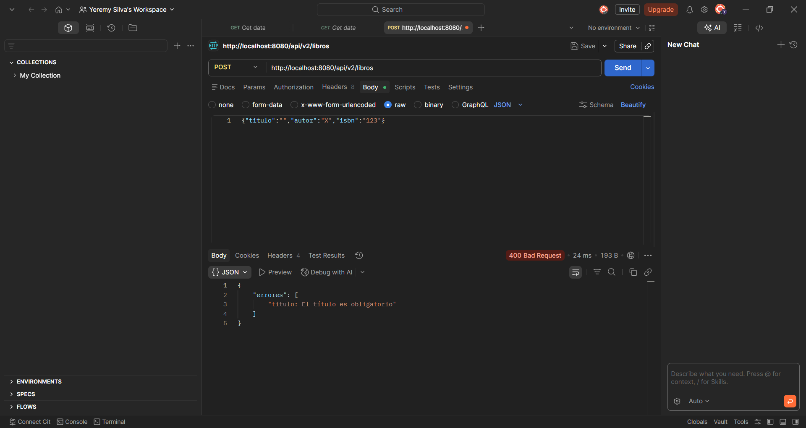
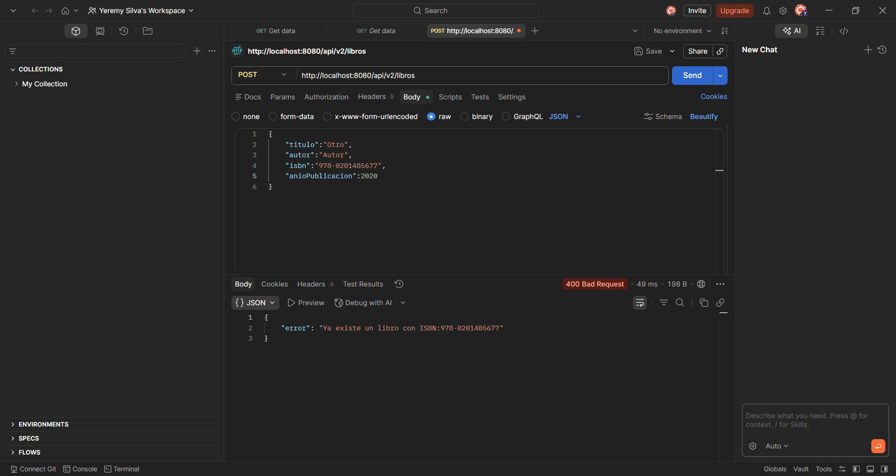
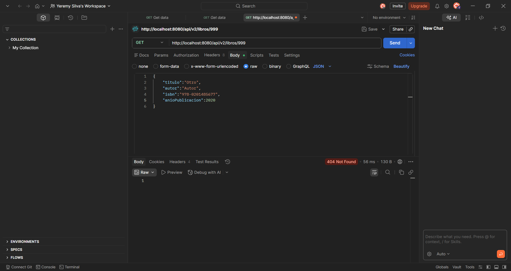

# Biblioteta API

API REST para gestionar un catálogo de libros. Permite listar, consultar, crear y eliminar registros usando Spring Boot, JPA y una base de datos H2 en memoria.

## Descripción del proyecto

El proyecto expone un servicio REST para administrar libros mediante una capa de controlador, servicio, repositorio, entidades y DTOs. Incluye validación de entrada, manejo de errores y documentación OpenAPI/Swagger.

Características principales:

- CRUD básico de libros.
- Validación de datos con Jakarta Validation.
- Persistencia con Spring Data JPA.
- Base de datos H2 en memoria.
- Documentación interactiva con Swagger UI.
- Capturas de resultados y errores incluidas en la carpeta `docs`.

## Tecnologías y dependencias

- Java 25
- Spring Boot 4.0.5
- Spring Web MVC
- Spring Data JPA
- Spring Validation
- H2 Database
- Springdoc OpenAPI UI
- Lombok
- Maven Wrapper

## Instrucciones de ejecución

### Requisitos previos

- Tener instalado Java 25.
- Tener acceso a Maven o usar el Maven Wrapper incluido en el proyecto.

### Ejecutar la aplicación

En Windows:

```bash
mvnw.cmd spring-boot:run
```

En Linux o macOS:

```bash
./mvnw spring-boot:run
```

### Verificar la aplicación

Una vez levantada, podés acceder a:

- API REST: `http://localhost:8080/api/v2/libros`
- Swagger UI: `http://localhost:8080/swagger-ui.html`
- OpenAPI JSON: `http://localhost:8080/api-docs`
- Consola H2: `http://localhost:8080/h2-console`

### Ejemplos de endpoints

- `GET /api/v2/libros` lista todos los libros.
- `GET /api/v2/libros/{id}` obtiene un libro por ID.
- `POST /api/v2/libros` crea un libro nuevo.
- `DELETE /api/v2/libros/{id}` elimina un libro por ID.

## Capturas de pantalla

Las capturas están en la carpeta `docs` y se muestran abajo como referencia de los endpoints y validaciones.

### Validación de datos

Se muestra cuando el cuerpo de la petición no cumple con las reglas de validación.



### ISBN duplicado

Se devuelve cuando se intenta registrar un libro con un ISBN ya existente.



### Libro no encontrado

Se obtiene al consultar o eliminar un libro que no existe.



## Estructura general

- `src/main/java`: código fuente de la API.
- `src/main/resources`: configuración de la aplicación.
- `docs`: capturas de pantalla de endpoints y resultados.

## Notas

- La base de datos H2 se crea en memoria al iniciar la aplicación.
- El esquema se genera automáticamente con `ddl-auto=create-drop`.
- Al cerrar la aplicación, los datos se pierden.
